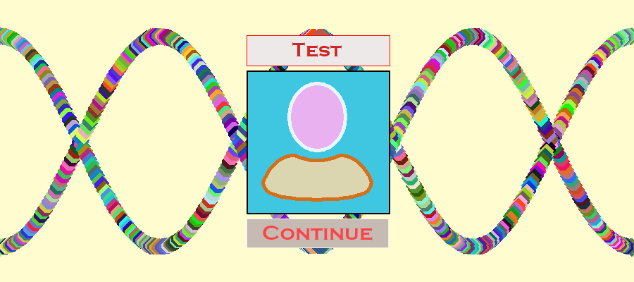

# Tic-Tac-Toe
(Python, Tkinter, Random)

This is my first desktop mini-project :P

## Review

1. You can choose game mode:

2. You can choose a nickname:

3. How game looks like:

4. Win screen:

5. Scores screen:

## Launching

1. Clone this repository.
2. `cd` into this directory.
3. `\venv\Scripts\activate.bat`
4. `python ttt.py`
5. Enjoy!

or 

1. Clone this repository.
2. Open compiled `TicTacToe.exe` in TTT folder.
